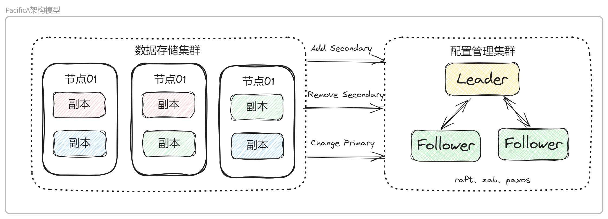
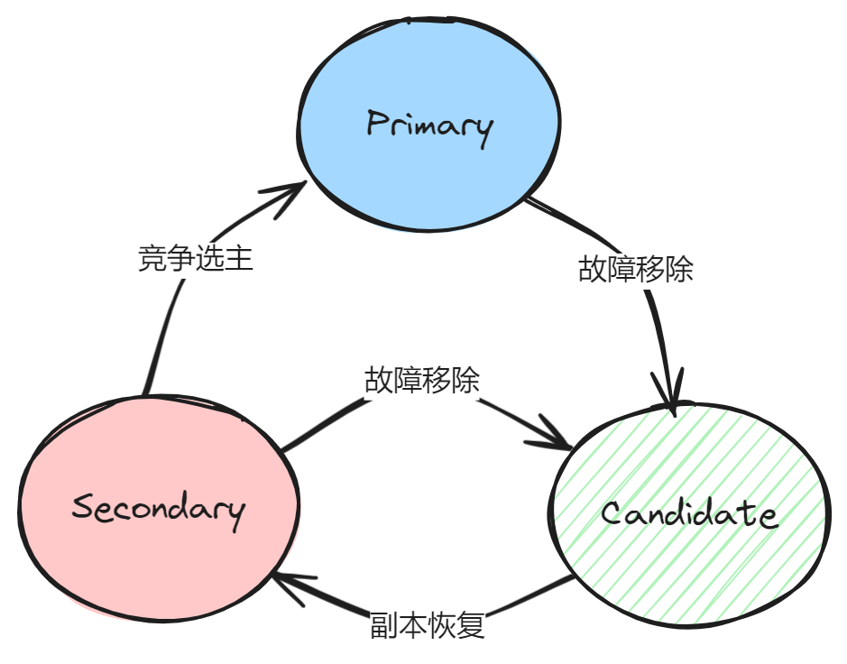
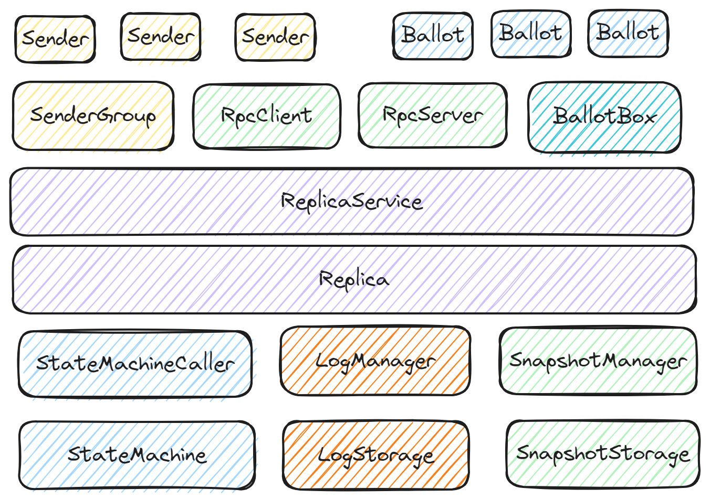

# 用户指南

## 常见名词及解释

- **副本(Replica)**  
  数据存储的基本单元
- **副本组(ReplicaGroup)**  
  由一个或多个副本组成
- **主副本(Primary)**  
  每个副本组有且仅有一个副本的状态为主副本，负责处理写请求，并将操作日志复制发送到其他副本
- **从副本(Secondary)**  
  每个副本组可以有多个副本的状态为从副本，当主副本故障后，可以竞争并最终有且仅有一个从副本竟选成为主副本，每个从副本都将参与“写”请求的投票
- **候选副本(Candidate)**  
  副本故障后，状态变为候选副本，并开启恢复流程，将从主副本复制快照和操作日志，以追赶主副本，并在追赶成功后，恢复状态为从副本
- **日志序号**  
  每个副本写请求分配一个单调递增的操作日志序号
  

## 模型架构
  
如上图所示，在PacificA中，将“数据存储复制”与“副本配置管理”分离，
其中“数据存储集群”数据以“副本”的形式分布在不同的节点，多个“副本”组成“副本组”，
也可以称作“切片”，多个副本间通过复制主副本的操作日志实现数据一致。
“配置管理集群”负责维护系统中所有副本组的配置。对于每个副本组，
配置管理集群将维护当前的配置及其版本号。  
在JPacificA中，由于每个应用的情况不同，没有通用的标准，故我们没有提供相应的配置集群的实现，
然而我们定义了相应的接口，各个应用可以依据自身特点实现即可，可以是基于任何算法的，如zookeeper、raft等。
此外，在counter的例子中，你可以找到我们基于SOFAJRaft的实现，或许你可以参考。

## 副本状态转换图
  
在JPacificA中采用租期(Leases)的方式实现主/从副本间的故障检测。  
主副本定期向从副本发送心跳请求，并收到“成功”的响应后即为获得来自指定从副本的租约(lease),
若主副本长时间未收到心跳响应(超过租赁期lease period)，则认为从副本故障，并联系配置管理集群要求将故障的从副本从副本组中移除。
若移除成功，故障从副本的状态将由Secondary转为Candidate(候选状态)。  
同时，从副本维护了最近一次来自主副本的心跳请求，若长时间未收到来自主副本的心跳请求(超过宽限期grace period)，
则认为主副本故障，将联系配置管理集群要求移除故障主副本并竟选成为新的主副本。若成功竞选，则该从副本的状态由Secondary转变为Primary，
同时旧的主副本的状态由Primary转为Candidate。  
对于候选状态的副本，将定时向主副本发送恢复请求，主副本收到恢复请求后，开始向候选副本发送快照或复制日志，
一旦候选副本的操作日志的序号追赶上了，主副本将联系配置管理集群要求将候选副本加入副本组内，成功后，候选副本的状态由Candidate转为Secondary。  
在配置管理集群中，为每个副本组维护了一个单调递增的版本号(version),每次副本组的变更都会让该版本号自增。
每次配置变更请求都会携带当前配置的版本号，当且仅当请求中的版本号于配置管理集群中的版本号匹配时，才会处理并响应请求，否则拒绝。
这可以保证多个从副本同时竞争选主时，只有一个从副本可以成功，其他均为失败。

## 核心组件设计
  
上图列出了JPacificA中的核心组件，基本与SOFAJRaft中的设计保持一致，因为它抽象地实在太好了，何不站在巨人的肩膀上呢？  

- **ReplicaService**  
  声明了处理副本间rpc请求的接口，包含AppendEntriesRequest、InstallSnapshotRequest、ReplicaRecoverRequest、GetFileRequest等
- **Replica**  
  代表一个副本，JPacificA中提供了默认的实现ReplicaImpl，其封装了底层的所有服务，
  用户可以调用主副本的apply(Operation)将“写”操作应用到副本组中，最终该操作会被提交到用户定义的状态机。
- **StateMachine**  
  用户需要实现的业务状态机，通过onApply(operationIterator)批量地将“写”操作应用到业务状态机中，同时提供了一个实现模板BaseStateMachine,
  用户可以继承它实现业务，或直接实现StateMachine接口。
- **StateMachineCaller**  
  封装了用户的业务状态机，将“写”操作按照提交顺序批量的提交至用户的业务状态机，并维护副本内部的提交点，以及在合适的时机触发业务状态机的onSnapshotLoad(快照加载)、onSnapshotSave(快照保存)
- **LogStorage**  
  操作日志存储，对“写”操作序列化后并存储，以便主副本向其他副本复制日志以及重启时重放未合并到快照中的日志。JPacificA提供了默认的实现FsLogStorage，
  若有特殊需求，可以实现LogStorageFactory中的newLogStorage接口方法，并通过ReplicaOption.setPacificaServiceFactory或SPI注解告知JPacificA。
- **LogManager**  
  封装了LogStorage实现，实现批量地存储、裁剪日志，完成对LogStorage的调用。
- **SnapshotStorage**  
  快照镜像存储，JPacificA提供了默认的实现DefaultSnapshotStorage，若有特殊需求，
  可以实现SnapshotStorageFactory中的newSnapshotStorage接口方法，并通过ReplicaOption.setPacificaServiceFactory或SPI注解告知JPacificA。
- **SnapshotManager**  
  封装SnapshotStorage，负责对底层SnapshotStorage的调用。JPacificA定时检查并执行快照存储，
  将用户的业务状态机中的内容持久化至SnapshotStorage中存储，同时对该检查点之前的操作日志进行清理，防止操作日志过多导致磁盘空间不足。
- **Sender**  
  由主副本维护，并向其他副本复制操作日志，维护心跳信息等
- **SenderGroup**  
  有多个Sender组成，主副本负责维护
- **BallotBox**  
  投票箱，对Quorum机制的实现
- **RpcServer**  
  实现副本间rpc通信，JPacificA默认提供了基于Grpc的实现
  也可以通过SPI注解指定其他RpcFactory的实现，并调用JPacificaRpcServerFactory.addPacificaRequestHandlers将内部的请求处理器注册到RpcServer
- **RpcClient**
  实现副本间rpc通信, 由Sender封装调用
- **ReplicaServiceManager**  
  ReplicaService管理器，我们期望用户的单个节点上不止一个副本，故ReplicaServiceManager将这些副本管理起来，方便rpc请求通过副本ID快速定位到对应的ReplicaService,
  并处理请求，默认提供了DefaultReplicaServiceManager，你也可以通过SPI指定自己的实现。
- **Endpoint**  
  表示一个服务地址，包括IP和端口
- **EndpointManager**  
  JPacificA对节点进行了抽象，用户为每个节点分配nodeId，并通过EndpointManager将nodeId与指定EndPoint进行绑定，
  这可以帮助应用解决IP变更的场景。
- **ReplicaId**  
  抽象副本编号，每个副本拥有集群内唯一的坐标，由组名(groupName)和节点ID(nodeId)组成。
- **ConfigurationClient**  
  声明与配置管理集群交互的客户端接口，由于不同应用的元数据存储不一，所以没有提供通用的默认实现，用户需要根据实际情况自行实现，
  不过你可以参考counter例子中的实现。或许我们应该对不同的算法（zookeeper、raft等）提供默认的实现，若有兴趣，随时欢迎贡献你的代码。

